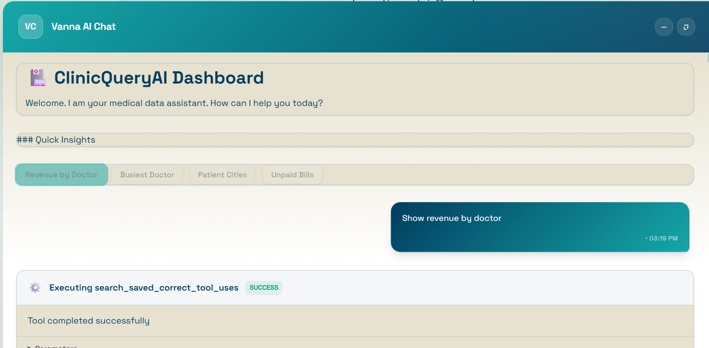
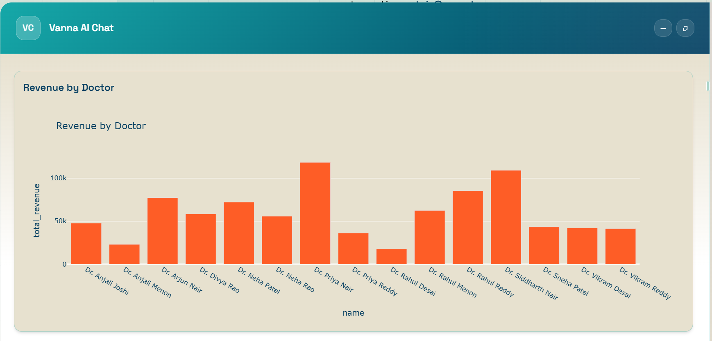

#  ClinicQueryAI: Natural Language to SQL Agent

##  Project Description
ClinicQueryAI is a robust backend Natural Language to SQL (NL2SQL) REST API built for a simulated clinic management database. It allows users to ask plain English questions and instantly receive structured data, SQL queries, and Plotly chart configurations without writing a single line of code. 

Built using **Vanna AI 2.0**, **FastAPI**, and **Google Gemini (gemini-2.5-flash)**, this system features strict SQL validation, in-memory caching, rate limiting, and an intelligent agent memory pre-seeded with gold-standard Q&A pairs to guarantee zero hallucinations.

---

##  Architecture Overview 
The system follows a strict, secure, and linear pipeline:
1. **Client Request:** User submits a natural language question via the `/chat` endpoint.
2. **FastAPI & Middleware:** The request is validated (Pydantic), rate-limited (SlowAPI), and checked against an in-memory cache for repeated questions.
3. **Vanna 2.0 Agent:** The question is routed to a Vanna Agent powered by `GeminiLlmService`. It consults its `DemoAgentMemory` (pre-seeded with strict schema rules and 15 Gold-Standard examples) to generate precise SQL.
4. **Strict SQL Validation:** A custom `ValidatedSqliteRunner` inspects the query using regex word boundaries. It guarantees a safe `SELECT` statement and blocks all malicious keywords (e.g., `DROP`, `UPDATE`, `EXEC`).
5. **Database Execution:** The safe SQL executes against the built-in SQLite database (`clinic.db`).
6. **Response:** Results are formatted into a JSON payload containing the explanation, SQL, data rows, and Plotly charts.

---

##  Key Features & Bonus Points Achieved

Here is visual proof of the extra credit features implemented to ensure a production-ready API:

- **Chart Generation (Bonus):** Automatically returns Plotly visualization payloads for analytical queries.
   
  
   
  

- **LLM Provider:** **Google Gemini** (`gemini-2.5-flash`) via `vanna.integrations.google`.
- **Zero-Hallucination Prompting:** Hard-injected schema context guarantees the LLM never invents tables like `sales` or `orders`.
- **Query Caching (Bonus):** Application-level query cache serves exact-match repeated questions instantly.
- **Rate Limiting (Bonus):** Secured the `/chat` endpoint with a 5 request/minute rate limit.
- **Input Validation (Bonus):** Pydantic models strictly validate user input (length restrictions, whitespace prevention).
- **Structured Logging (Bonus):** Comprehensive `logging` tracks system health, cache hits, and execution flows.
- **Automated Evaluator:** Includes a high-speed asynchronous test script (`run_tests.py`) that strictly validates 20 complex test cases.

---

##  Tech Stack
- **Backend Framework:** FastAPI, Uvicorn
- **AI Agent Orchestration:** Vanna AI 2.0
- **LLM:** Google Gemini (`gemini-2.5-flash`)
- **Database:** SQLite (Built-in SqliteRunner)
- **Data Processing & Viz:** Pandas, Plotly

---

##  Setup & Installation Instructions

### 1. Prerequisites
- Python 3.10 or higher
- A free Google Gemini API Key (Get one at [Google AI Studio](https://aistudio.google.com/apikey))
### 2. Clone the Repository
    
    git clone https://github.com/ACHYUTH1203/Clinic-Query-AI.git
    cd Clinic-Query-AI

### 3\. Configure Environment Variables

### Create a `.env` file in the root directory and add your Gemini API key:

    GOOGLE_API_KEY="your_gemini_api_key_here"

### 4\. Quick Start (Evaluator Command)

### You can install dependencies, set up the database, seed the memory, and run the server all in one command:

    pip install -r requirements.txt && python setup_database.py && python seed_memory.py && uvicorn main:app --port 8000

* * *

##  Running Scripts Individually & Testing

### If you prefer to run the architecture steps one by one:

**1\. Initialize the Database:** Creates `clinic.db` and populates it with realistic dummy data.

    python setup_database.py

**2\. Run the Memory Seeding Script:** Injects 15 gold-standard QA pairs and strict database schema rules into the Vanna `DemoAgentMemory`.

    python seed_memory.py

**3\. Start the API Server:** Launches the production-ready REST API.

    uvicorn main:app --port 8000

###  Automated NL2SQL Evaluator

### 

To verify the integrity of the SQL generation against the 20 assignment test questions, run:

    python run_tests.py

_(Results are saved to `RESULTS.md`)_

###  Testing Bonus Features (Security & Rate Limits)

### To verify the Pydantic Input Validation (422 errors) and the SlowAPI Rate Limiter (429 errors), ensure the FastAPI server is running in a separate terminal, then execute:

    python test_api_security.py

* * *

##  API Documentation & Examples

### 1\. Chat Query

### 

Submit a natural language question to generate SQL and retrieve data.

**Endpoint:** `POST /chat`

**Headers:**
`Content-Type: application/json`

**Request Body:**

JSON

    { 
      "question": "Show me the top 5 patients by total spending" 
    }

**Success Response (200 OK):**

JSON

    {
      "message": "Here are the top 5 patients by total spending...",
      "sql_query": "SELECT p.first_name, p.last_name, SUM(i.total_amount) as total_spending FROM patients p JOIN invoices i ON p.id = i.patient_id GROUP BY p.id ORDER BY total_spending DESC LIMIT 5",
      "columns": [
        "first_name", 
        "last_name", 
        "total_spending"
      ],
      "rows": [
        ["Amit", "Deshmukh", 27563.05], 
        ["Nisha", "Das", 26761.90]
      ],
      "row_count": 2,
      "chart": { 
        "data": [...], 
        "layout": {...} 
      },
      "chart_type": "plotly"
    }

**Error Responses:**

*   `429 Too Many Requests`: Triggered if exceeding 5 requests per minute.
    
*   `422 Unprocessable Entity`: Triggered if the question is empty or under 5 characters.
    
*   `500 Internal Server Error`: Returned if an invalid SQL query is caught by the validation runner.
    

* * *

### 2\. Health Check

### 

Checks database connectivity and agent memory status.

**Endpoint:** `GET /health`

**Success Response (200 OK):**

JSON

    { 
      "status": "ok", 
      "database": "connected", 
      "agent_memory_items": 15 
    }
